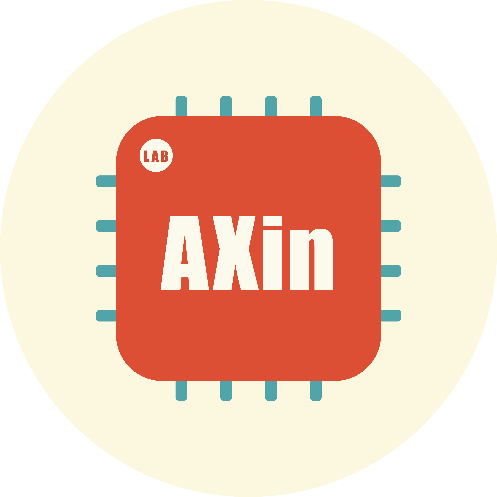
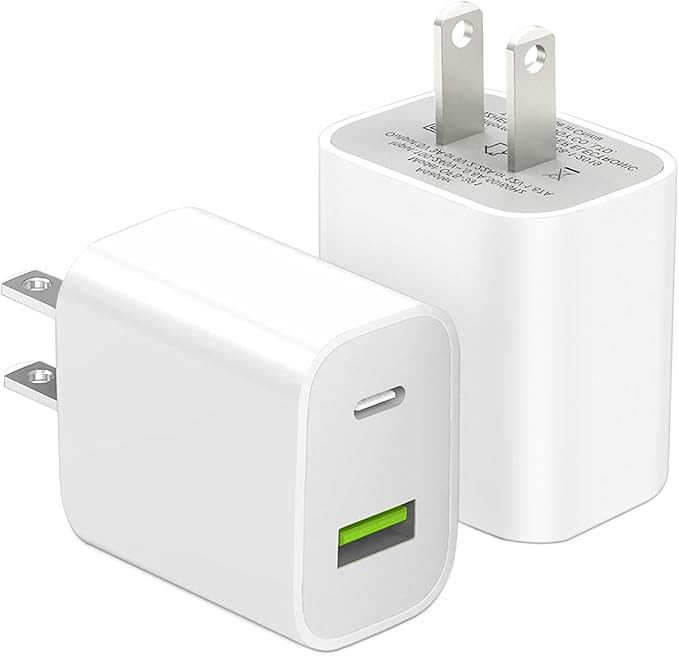
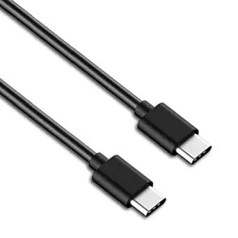
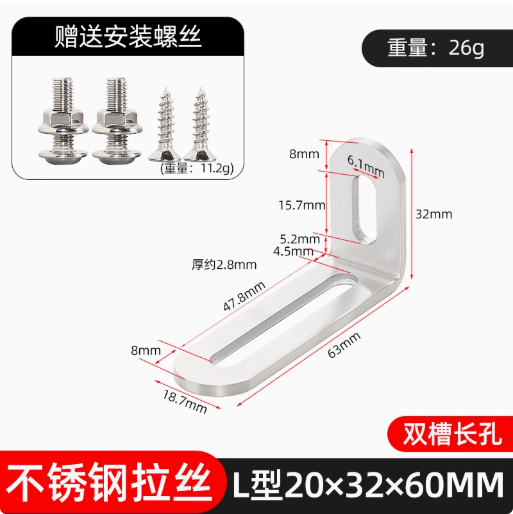
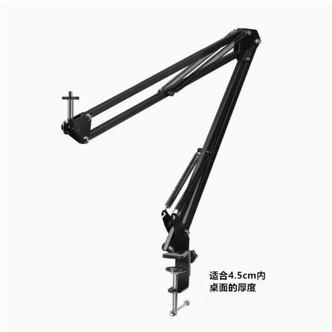
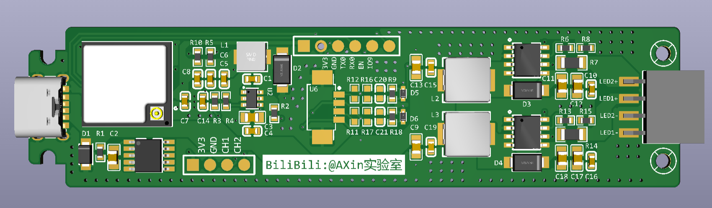
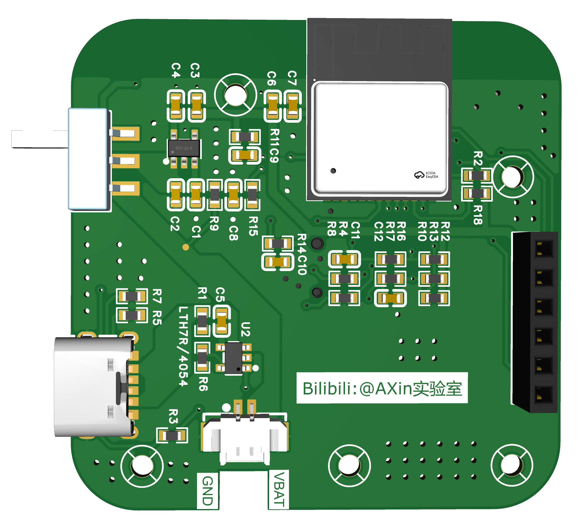
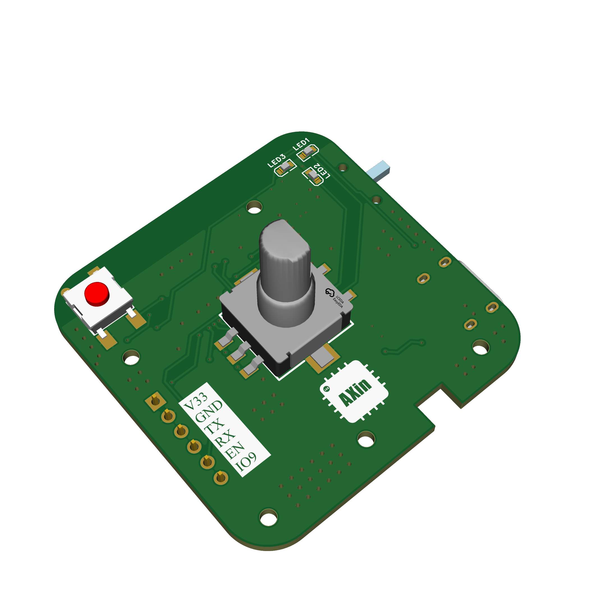
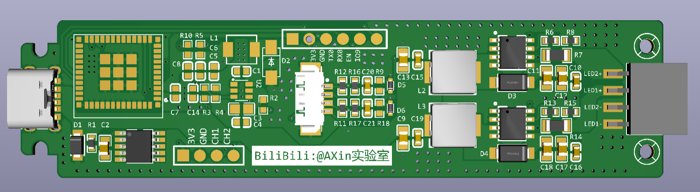
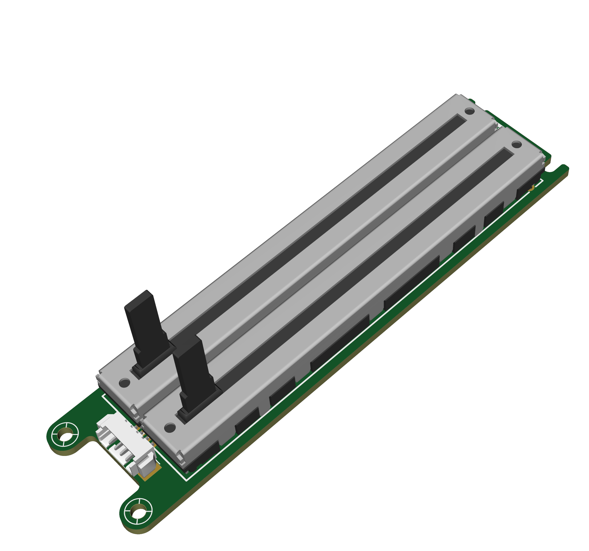

# Sunlike 护眼台灯

使用首尔半导体Sunlike灯珠开发了一款具有无线控制和滑动控制双交互模式的台灯，结构灵活，可根据实际使用环境灵活调节灯管结构。控制器基于ESP32-C2模组，采用Arduino框架进行开发。  
版权说明：本项目允许用户查看、使用、修改源代码。禁止将项目或其衍生作品用于商业目的（例如：销售、作为商业服务的一部分盈利）。用户在使用或分发（包括修改版）时，必须保留原始版权和许可声明（注明出处）

<!-- PROJECT SHIELDS -->

[![Contributors][contributors-shield]][contributors-url]
[![Forks][forks-shield]][forks-url]
[![Stargazers][stars-shield]][stars-url]
[![Issues][issues-shield]][issues-url]
[![MIT License][license-shield]][license-url]
[![BiliBili][linkedin-shield]][linkedin-url]

<!-- PROJECT LOGO -->
<br />

<p align="center">
  <a href="https://github.com/grant-Gan/desktop_smart_lamp/">
    
  </a>
s
  <h3 align="center">AXin实验室</h3>
  <p align="center">
    生命不息，折腾不止，Axin致力于DIY想要又买不起的产品~
    <br />
    <a href="https://github.com/grant-Gan/desktop_smart_lamp"><strong>探索本项目的文档 »</strong></a>
    <br />
    <br />
    <a href="https://github.com/grant-Gan/desktop_smart_lamp">查看Demo</a>
    ·
    <a href="https://github.com/grant-Gan/desktop_smart_lamp/issues">报告Bug</a>
    ·
    <a href="https://github.com/grant-Gan/desktop_smart_lamp/issues">提出新特性</a>
  </p>

</p>

 
## 目录

- [重点提示](#重点提示)
- [下载步骤](#下载步骤)
- [文件目录说明](#文件目录说明)
- [使用的框架](#使用的框架)
- [依赖库](#依赖库)
- [版本控制](#版本控制)
- [零件选型](#零件选型)
    1. [电源适配器](#电源适配器)
    2. [数据线](#数据线)
    3. [灯管](#灯管)
    4. [角码](#角码)
    5. [悬臂支架](#悬臂支架)
    6. [其它](#其它)
- [PCB焊接](#PCB焊接)
    1. [无线控制版本](#无线控制版本)
    2. [滑动控制版本](#滑动控制版本)
- [作者](#作者)
- [版权说明](#版权说明)

### 重点提示

截至到目前，台灯的旋转控制器代码仍然有Bug，AXin正在利用业余时间修复中，只能保证基础功能的正常使用。建议大家优先复刻滑动控制版本。

待开发功能：
1. 控制器Deep Sleep模式修复
2. 控制器与驱动板自动配对
3. 控制器低电提醒
4. HomeAssistant接入

### 下载步骤
Clone the repo

```sh
git clone https://github.com/grant-Gan/desktop_smart_lamp.git
```

### 文件目录说明

```
desktop_smart_lamp 
├── README.md
├── LICENSE
├── /3D_Model
│  ├── /Lamp_case
│  ├── /Rotary_Controller
│  ├── /Slider_Controller
├── /BOM
│  ├── /BOM_Base_Board_2025-07-23.xlsx
│  ├── /BOM_Driver Board _2025-07-23.xlsx
│  ├── /BOM_Rotary_Controller_Board_2025-07-23.xlsx
│  ├── /BOM_Slider_Controller_Board_2025-07-23.xlsx
├── /images
├── /Code
│  ├── /Lamp_Driver
│  ├── /Lamp_Driver
├── /PCBA
│  ├── /Gerber_Base_Board_20250723.zip
│  ├── /Gerber_Driver_Board_20250723.zip
│  ├── /Gerber_Rotary_Controller_Board_20250723.zip
│  ├── /Gerber_Slider_Controller_Board_20250723.zip
├── /Schematic
│  ├── /Base_board.pdf
│  ├── /Driver_board.pdf
│  ├── /Rotary_Controller_Board.pdf
│  ├── /Slider_Controller_board.pdf

```

### 使用的框架
[esp-idf](https://github.com/espressif/esp-idf) 


### 依赖库

- [arduino-esp32](https://github.com/espressif/arduino-esp32)
- [Button2](https://github.com/LennartHennigs/Button2)
- [ai-esp32-rotary-encoder](https://github.com/igorantolic/ai-esp32-rotary-encoder)


### 版本控制

该项目使用Git进行版本管理。您可以在repository参看当前可用版本。

### 零件选型
#### 电源适配器
本项目设计最大功耗为30W，输入电压为12~20V，20V时效率比较高，驱动板发热下降，推荐首选。因此需要使用额定30W以上、支持20V输出、支持PD充电协议的电源适配器，大部分手机配的快充头，如果功率大于30W，有TYPE-C接口都可以使用，不必额外购买。
<p align="center">
    
  <p align="center">有Type-C输出的电源适配器，通常支持PD协议</p>
</p>

#### 数据线
本项目使用的时C2C快充数据线，建议额定功率60W以上，长度根据使用环境选择，AXin使用的是2米的数据线，能够匹配大部分使用场景。
<p align="center">
    
  <p align="center">C2C快充数据线</p>
</p>

#### 灯管
本项目使用70cm长，横截面宽26mm，高11mm的铝合金灯管，购买地址见B站视频。商家默认出售的是1米长度，请留言需要裁剪。

#### 角码
本项目使用的是20*32*60的L型不锈钢角码，若想选用其他型号，需要保证螺丝孔开口大于6.0mm以上，能够让悬臂支架上1/4螺丝头伸进去。
<p align="center">
    
  <p align="center">20x32x60角码</p>
</p>

#### 悬臂支架
本项目使用的是带有1/4螺丝的悬臂支架配合铝制夹具，需要注意的是由于灯管比较长，力臂较大，一定要选择质量足够好的悬臂支架才行，不然固定扳手的螺母会滑丝，建议大家不要贪图便宜，在正规渠道购买。
<p align="center">
    
  <p align="center">带1/4螺丝的悬臂支架</p>
</p>

#### 其它
其它零件暂时没有需要重点注意的，想起来或者等到后续问的朋友比较多再行补充~

### PCB焊接

#### 无线控制版本
- 驱动板  
无线控制驱动板使用ESP32-C2模组，使用PWM调光，驱动芯片为LGS63042EP,中间部分仅需要焊接R9、R18两个下拉电阻及D5、D6两个稳压二极管，其中稳压二极管用于保护驱动芯片EN引脚，可选。  
**注意事项：驱动端输出电压较高，需使用50V以上电容。**
<p align="center">
    
无线控制版驱动板焊接参考 
</p>
  
- 控制板   
**注意事项：控制器焊接需要留意编码器的选型，本项目采用的编码器型号为EC11、手柄长度12mm、梅花柄、正码（顺时针）、旋转一圈脉冲20位**

<p align="center">
  
  <p align="center">控制器焊接参考</p>
</p>

<p align="center">
  
  <p align="center">控制器焊接参考</p>
</p>


#### 滑动控制版本
- 驱动板  
滑动控制版本可以不焊接控制器、DCDC部分的元器件，成本低不少，若没有无线控制需求，推荐给大家优先尝试。具体需要焊接的元件请参考下方的焊接参考图和原理图。
**注意事项：驱动端输出电压较高，需使用50V以上电容。**
<p align="center">
    
滑动控制版驱动板焊接参考 
</p>  

- 滑动控制板  
这里没什么好说的，直接按照图焊接好就行。
<p align="center">
    
  <p align="center">滑动控制板</p>
</p>  


### 作者

AXin实验室

Bilibili:@AXin实验室 小红书:@AXin实验室   

### 版权说明
本项目采用 **Creative Commons Attribution-NonCommercial-ShareAlike 4.0 International License** 授权。
您可自由地：
*   **共享** — 在任何媒介以任何形式复制、发行本作品
*   **演绎** — 修改、转换或以本作品为基础进行创作

惟须遵守以下条件：
*   **署名** — 您必须给出[适当的署名](https://creativecommons.org/licenses/by-nc-sa/4.0/deed.zh)，提供指向本许可协议的链接，同时标明是否（对原始作品）作了修改。您可以用任何合理的方式来署名，但不得以任何方式暗示许可人为您或您的使用背书。
*   **非商业性使用** — 您不得将本作品用于商业目的。
*   **相同方式共享** — 如果您再混合、转换或者基于本作品进行创作，您必须基于[与原先许可协议相同的许可协议](https://creativecommons.org/licenses/by-nc-sa/4.0/deed.zh) 分发您贡献的作品。

完整的许可条款请见：[LICENSE](LICENSE) 文件。

该项目签署了MIT 授权许可，详情请参阅 [LICENSE.txt](https://github.com/grant-Gan/desktop_smart_lamp/LICENSE.txt)


<!-- links -->
[your-project-path]:grant-Gan/desktop_smart_lamp
[contributors-shield]: https://img.shields.io/github/contributors/grant-Gan/desktop_smart_lamp.svg?style=flat-square
[contributors-url]: https://github.com/grant-Gan/desktop_smart_lamp/graphs/contributors
[forks-shield]: https://img.shields.io/github/forks/grant-Gan/desktop_smart_lamp.svg?style=flat-square
[forks-url]: https://github.com/grant-Gan/desktop_smart_lamp/network/members
[stars-shield]: https://img.shields.io/github/stars/grant-Gan/desktop_smart_lamp.svg?style=flat-square
[stars-url]: https://github.com/grant-Gan/desktop_smart_lamp/stargazers
[issues-shield]: https://img.shields.io/github/issues/grant-Gan/desktop_smart_lamp.svg?style=flat-square
[issues-url]: https://img.shields.io/github/issues/grant-Gan/desktop_smart_lamp.svg
[license-shield]: https://img.shields.io/github/license/grant-Gan/desktop_smart_lamp.svg?style=flat-square
[license-url]: https://github.com/grant-Gan/desktop_smart_lamp/blob/master/LICENSE.txt
[linkedin-shield]: https://img.shields.io/badge/-LinkedIn-black.svg?style=flat-square&logo=linkedin&colorB=555
[linkedin-url]: https://www.bilibili.com/video/BV1rygnzuE4w


